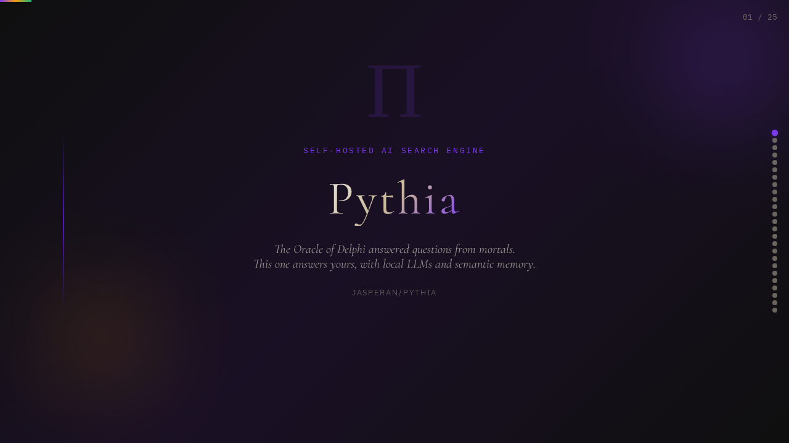
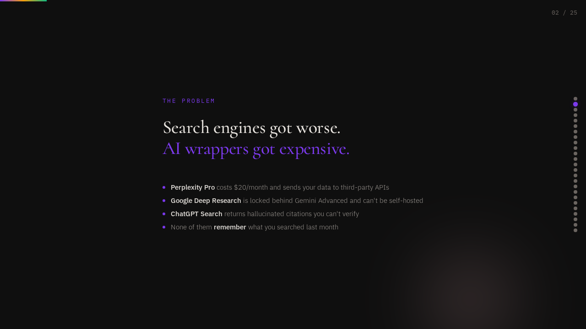
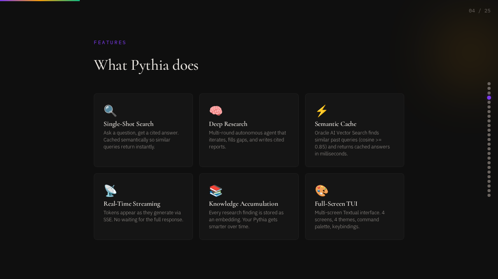
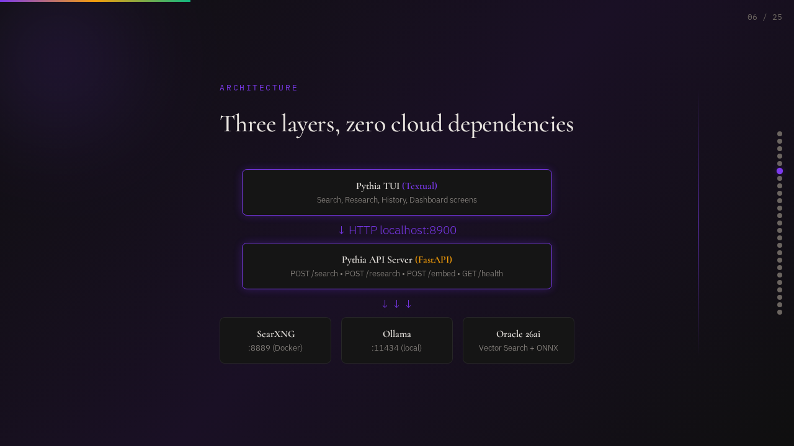
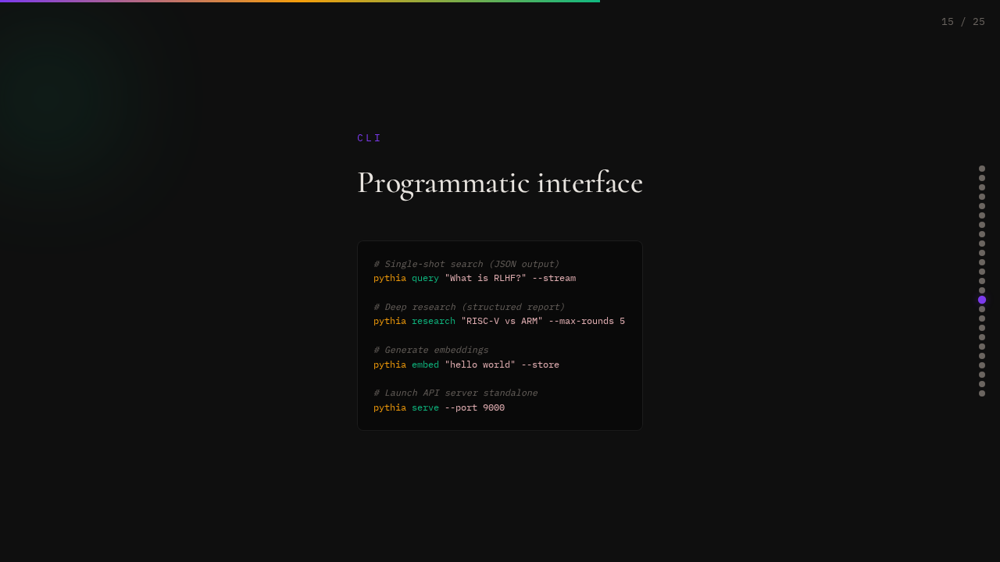
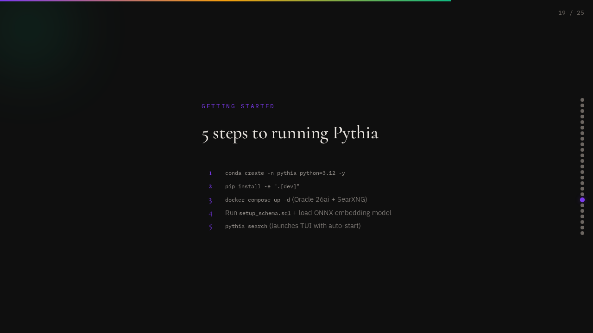
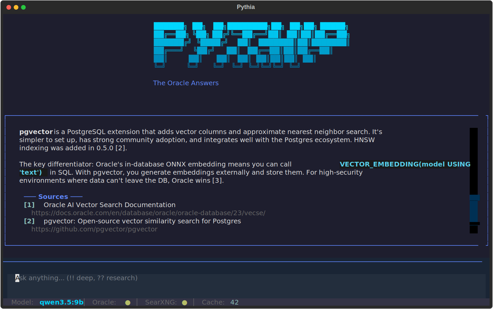
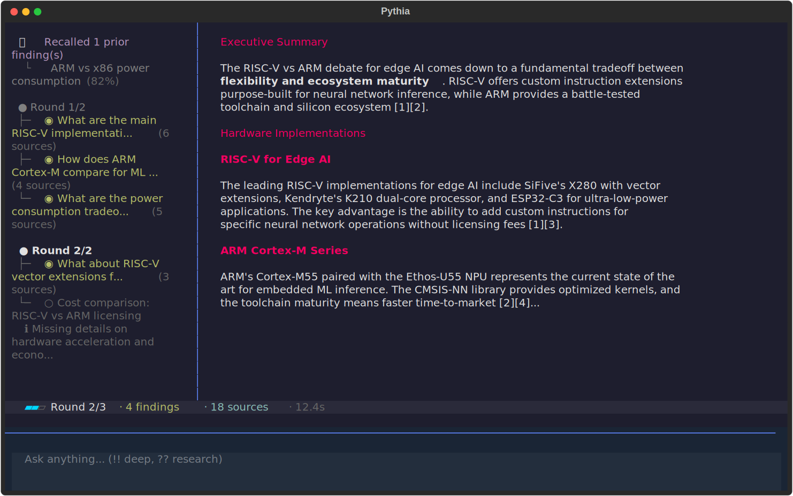
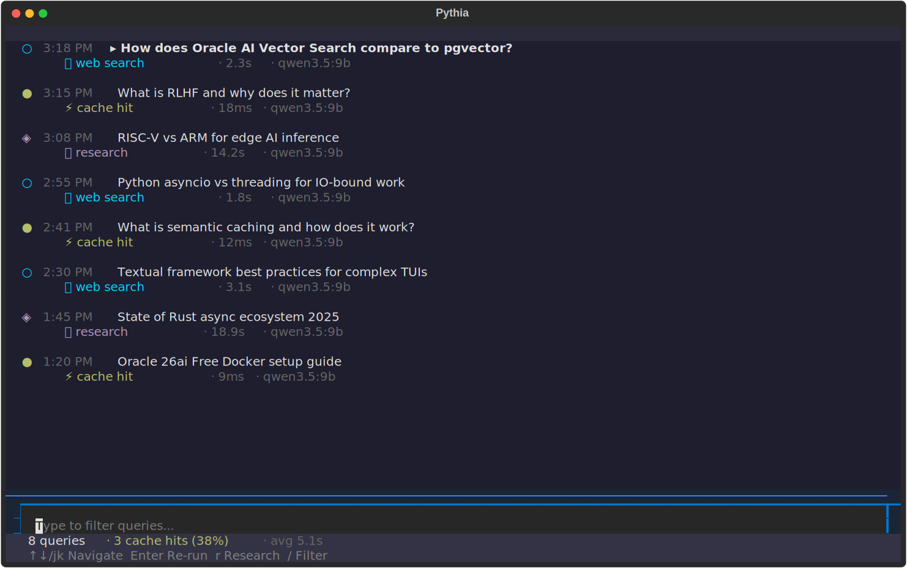
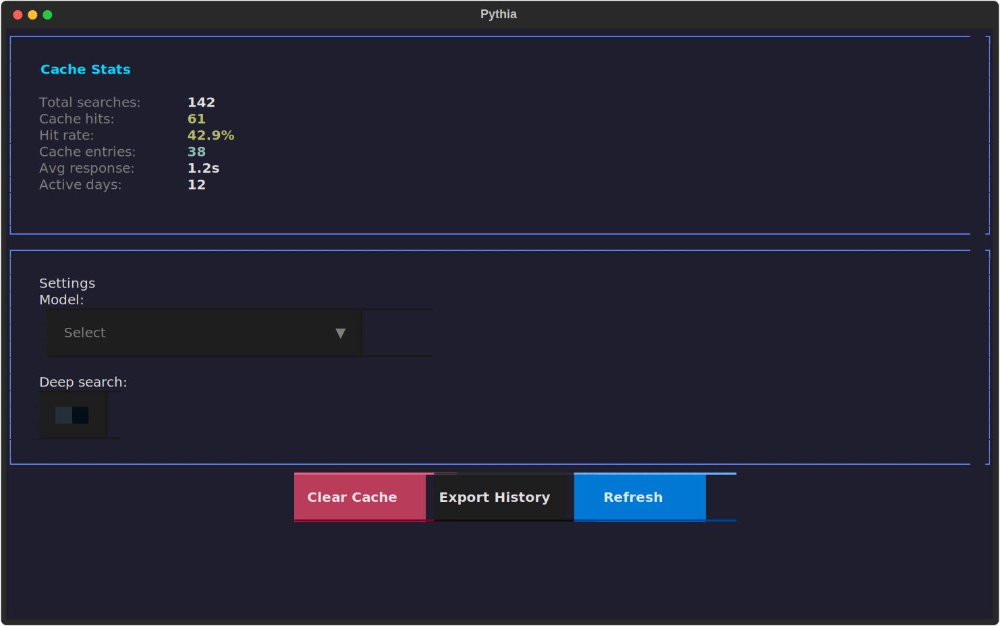

# Pythia

<div align="center">

**[View Interactive Presentation](docs/slides/presentation.html)** | Animated overview of the project

</div>

<table>
<tr>
<td></td>
<td></td>
</tr>
<tr>
<td></td>
<td></td>
</tr>
<tr>
<td></td>
<td></td>
</tr>
</table>

**Self-hosted AI search engine with autonomous deep research** — a local Perplexity + Deep Research replacement combining SearXNG (free, unlimited web search), Ollama (local LLM inference), and Oracle AI Vector Search (semantic caching and knowledge accumulation).

Named after the priestess at the Oracle of Delphi who answered questions — a double meaning with Oracle Database as the backend.

## Screenshots

### Search Screen
Streaming answers with source citations, semantic cache hits, and result scrollback.



### Research Theater
Live visualization of the multi-round research agent. The tree (left) shows rounds, sub-queries, and findings updating in real-time as the agent thinks. The report streams on the right.



### History Screen
Browse, filter, and re-run past queries. Visual markers distinguish cache hits, web searches, and research sessions.



### Dashboard
Cache stats, response time sparklines, model picker, and cache management.



## Features

### Single-Shot Search
Ask a question, get a cited answer instantly — cached semantically so similar future queries return in milliseconds.

- **Semantic cache** — Oracle AI Vector Search finds similar past queries (cosine similarity >= 0.85) and returns cached answers instantly
- **Real-time streaming** — tokens appear as they're generated via SSE
- **Source citations** — inline `[1]`, `[2]` citations from web results
- **Deep scraping** — Scrapling scrapes full page content instead of snippets

### Deep Research (NEW)
Autonomous multi-step research agent that iteratively searches, analyzes gaps, and synthesizes comprehensive reports — like Perplexity Deep Research or Google Deep Research, but fully self-hosted.

```
pythia research "What are the tradeoffs between RISC-V and ARM for edge AI?"
```

**How it works:**

1. **Decompose** — LLM breaks the question into 3-5 focused sub-queries
2. **Search & Scrape** — each sub-query searched in parallel via SearXNG, top results scraped for full content
3. **Summarize** — LLM extracts key findings from each sub-query's results
4. **Analyze Gaps** — LLM reviews all findings and identifies what's still missing
5. **Iterate** — generates follow-up searches autonomously (up to configurable max rounds)
6. **Recall** — Oracle vector search finds related findings from *past* research sessions
7. **Synthesize** — produces a structured, cited research report with sections

**The knowledge accumulation advantage:** Every research session stores individual findings as embeddings in Oracle. Over time, your Pythia instance builds a personal knowledge base — when you research "RISC-V for edge AI" next month, it recalls relevant fragments from your previous research on "ARM vs x86 power efficiency". No stateless search engine can do this.

### Full-Screen TUI
Multi-screen terminal interface built with Textual. 4 screens (Search, Research, History, Dashboard), command palette, 4 themes, global keybindings. See [screenshots above](#screenshots).

### Programmatic CLI
Machine-friendly JSON output for scripting and pipelines:
- `pythia query` — single-shot search, returns JSON
- `pythia research` — deep research, returns structured report
- `pythia embed` — generate embeddings (single or batch)

### API Server
FastAPI server with SSE streaming for integration into other applications.

## Architecture

```
┌──────────────────────────────────────────────────────┐
│  Pythia TUI (Textual)                                │
│  Search results + AI answer + citations              │
│  Service Status: API | Oracle | SearXNG              │
└──────────────┬───────────────────────────────────────┘
               │ HTTP (localhost:8900)
┌──────────────▼───────────────────────────────────────┐
│  Pythia API Server (FastAPI)                         │
│  POST /search    → SSE single-shot search            │
│  POST /research  → SSE deep research                 │
│  POST /embed     → embedding generation              │
│  GET  /health, /history, /stats                      │
│  DELETE /cache                                       │
└───┬──────────┬──────────────┬────────────────────────┘
    │          │              │
    ▼          ▼              ▼
 SearXNG    Ollama      Oracle DB 26ai
 :8889      :11434     :1523/FREEPDB1
 (Docker)   (local)    (Vector Search + stored embeddings)
```

### Search Flow (Single-Shot)

1. **Parallel prefetch** — cache lookup and SearXNG web search fire concurrently
2. **Cache HIT** (similarity >= 0.85) — cancel web search, return cached answer instantly
3. **Cache MISS** — web search is already running; synthesize via Ollama with citations, store in Oracle (reuses the embedding from the cache check)
4. **Stream response** — tokens via SSE in real-time, with citation density metric in the DONE event

### Research Flow (Deep Research)

```
ResearchAgent
  ├── recall_knowledge()     → vector search Oracle for related past findings
  ├── plan_research()        → LLM decomposes into sub-queries
  │
  │  ┌─── Round 1..N ──────────────────────────────┐
  │  │  execute_round()      → parallel SearXNG search + scrape
  │  │  summarize_findings() → LLM extracts key findings per sub-query
  │  │  analyze_gaps()       → LLM identifies missing information
  │  │  generate_follow_ups  → new sub-queries for next round
  │  └─────────────────────────────────────────────┘
  │
  └── synthesize_report()    → structured markdown report with citations
```

### Oracle Storage Schema

| Table | Purpose |
|-------|---------|
| `pythia_cache` | Semantic search cache (query + embedding + answer + sources) |
| `pythia_history` | Search history with timing and cache hit stats |
| `pythia_research` | Research sessions (query + report + metadata) |
| `pythia_findings` | Individual research findings with embeddings for cross-session recall |
| `pythia_stats` | Analytics view (hit rate, avg response time, active days) |

## Prerequisites

- **Python 3.12+**
- **Docker** (for Oracle 26ai Free and SearXNG containers)
- **Ollama** installed and running locally
- **Conda** (recommended for environment isolation)

## Quick Start

<!-- one-command-install -->
> **One-command bootstrap** — clone the repo and install Python dependencies in a single step:
>
> ```bash
> curl -fsSL https://raw.githubusercontent.com/jasperan/pythia/master/install.sh | bash
> ```
>
> This does **not** start Docker, create the Oracle user/schema, or pull the Ollama model.
> Continue with the infrastructure and runtime steps below.
>
> <details><summary>Advanced options</summary>
>
> Override install location:
> ```bash
> PROJECT_DIR=/opt/myapp curl -fsSL https://raw.githubusercontent.com/jasperan/pythia/master/install.sh | bash
> ```
>
> Or install manually:
> ```bash
> git clone https://github.com/jasperan/pythia.git
> cd pythia
> # See below for setup instructions
> ```
> </details>


### 1. Create conda environment

```bash
conda create -n pythia python=3.12 -y
conda activate pythia
```

### 2. Install Pythia

```bash
cd ~/git/pythia
pip install -e ".[dev]"
```

### 3. Start infrastructure

```bash
# Start Oracle 26ai Free + SearXNG containers
docker compose up -d

# Wait for Oracle to be ready (~2 minutes on first start)
docker compose logs -f oracle  # wait for "DATABASE IS READY TO USE"

# Pull Ollama model for answer synthesis
ollama pull qwen3.5:9b
```

### 4. Set up Oracle schema

```bash
# Connect as ADMIN inside the Oracle container
docker exec -it pythia-oracle bash -lc "sqlplus admin/Welcome12345*@localhost:1521/FREEPDB1"
```

```sql
CREATE USER pythia IDENTIFIED BY pythia;
GRANT CONNECT, RESOURCE, UNLIMITED TABLESPACE, DB_DEVELOPER_ROLE TO pythia;
GRANT CREATE MINING MODEL TO pythia;
```

Then connect as the `pythia` user and run the schema:

```bash
docker exec -i pythia-oracle bash -lc "sqlplus pythia/pythia@localhost:1521/FREEPDB1" < setup_schema.sql
```

#### Embedding model note

Pythia's default runtime path generates embeddings in Python with
`sentence-transformers` (`all-MiniLM-L6-v2`) and stores them in Oracle via
`TO_VECTOR(...)`. You do **not** need to load a custom ONNX model to use the
CLI, API, or TUI.

If you want to experiment with Oracle-side `VECTOR_EMBEDDING()` later, see the
optional example comments in `setup_schema.sql`.

### 5. Run Pythia

```bash
# Launch the TUI (auto-starts API server, Oracle, SearXNG)
pythia search
```

## TUI Guide

### Launching

```bash
pythia search                          # Launch TUI with auto-start
pythia search --model llama3.3:70b     # Override LLM model
pythia search --no-auto-start          # Connect to existing server
```

### Screens

Switch screens with number keys `1`-`4` or the command palette (`Ctrl+P`).

| Key | Screen | What it does |
|-----|--------|--------------|
| `1` | **Search** | Ask questions, get cited answers. Results stack as you search (scrollback). |
| `2` | **Research** | Deep multi-round research. Live tree shows rounds, sub-queries, findings as the agent thinks. |
| `3` | **History** | Browse all past queries. Filter by type, fuzzy search, re-run or send to research. |
| `4` | **Dashboard** | Cache stats, response time sparklines, model picker, deep search toggle, cache management. |

### Keybindings

| Key | Action |
|-----|--------|
| `Ctrl+P` | Command palette (all actions searchable) |
| `1`-`4` | Switch screens |
| `Ctrl+D` | Toggle deep search mode |
| `Ctrl+T` | Cycle theme (dark, light, catppuccin-mocha, nord) |
| `Ctrl+L` | Clear current results |
| `Ctrl+E` | Export search history as markdown |
| `Ctrl+C` x2 | Quit (double-tap) |

### Search Prefixes

Type these in the search bar on any screen:

| Prefix | Action |
|--------|--------|
| (plain text) | Normal search |
| `!! query` | Deep search (scrapes full page content from top results) |
| `?? query` | Research mode (switches to Research screen, runs multi-round research) |

### History Screen Controls

| Key | Action |
|-----|--------|
| `j`/`k` or `↑`/`↓` | Navigate entries |
| `Enter` | Re-run selected query on Search screen |
| `r` | Send selected query to Research screen |
| `/` | Focus the text filter |

### Themes

4 built-in themes, cycle with `Ctrl+T`:
- **dark** (default) — cyan accent on dark background
- **light** — blue accent on light background
- **catppuccin-mocha** — mauve/pink accent, Catppuccin palette
- **nord** — frost blue accent, Nord palette

Set a default theme in `pythia.yaml`:
```yaml
tui:
  theme: "catppuccin-mocha"
```

### Slash Commands

| Command | Action |
|---------|--------|
| `/history` | Switch to History screen |
| `/stats` | Switch to Dashboard screen |
| `/model <name>` | Switch Ollama model (e.g., `/model llama3.3:70b`) |
| `/cache clear` | Purge Oracle cache |
| `/clear` | Clear results |
| `/help` | Show available commands |

## CLI Commands

### `pythia query` — Single-Shot Search (JSON)

```bash
pythia query "What is RLHF?"                    # Flat JSON output
pythia query "What is RLHF?" --stream            # NDJSON event stream
pythia query "What is RLHF?" --deep              # Scrape full page content
pythia query "What is RLHF?" --no-cache          # Skip cache
pythia query "What is RLHF?" --embed             # Include embedding in output
echo "What is RLHF?" | pythia query              # Pipe via stdin
```

### `pythia research` — Deep Research (JSON)

```bash
pythia research "RISC-V vs ARM for edge AI"                  # Flat JSON report
pythia research "RISC-V vs ARM for edge AI" --stream         # NDJSON events
pythia research "RISC-V vs ARM for edge AI" --max-rounds 5   # Override max rounds
pythia research "RISC-V vs ARM" --model llama3.3:70b         # Override model
```

**Output (flat mode):**
```json
{
  "query": "RISC-V vs ARM for edge AI",
  "report": "# Research Report\n\n## Executive Summary\n...",
  "sub_queries": ["What is RISC-V?", "ARM edge AI performance", ...],
  "findings": [...],
  "recalled_findings": [...],
  "rounds_used": 2,
  "total_findings": 8,
  "total_sources": 32,
  "elapsed_ms": 45000
}
```

**Output (stream mode):**
```
{"event": "status", "data": {"message": "Searching knowledge base..."}}
{"event": "recall", "data": {"count": 2, "findings": [...]}}
{"event": "plan", "data": {"sub_queries": ["...", "..."]}}
{"event": "round_start", "data": {"round": 1, "max_rounds": 3}}
{"event": "finding", "data": {"sub_query": "...", "summary_preview": "..."}}
{"event": "gap_analysis", "data": {"sufficient": false, "gaps": ["..."]}}
{"event": "round_start", "data": {"round": 2, "max_rounds": 3}}
{"event": "token", "data": {"content": "# Research Report..."}}
{"event": "done", "data": {"rounds_used": 2, "total_findings": 8, "elapsed_ms": 45000}}
```

### `pythia embed` — Embedding Generation

```bash
pythia embed "hello world"                        # Single text
pythia embed --file texts.jsonl                    # Batch from JSONL
pythia embed "hello world" --store                 # Store in Oracle
```

### `pythia serve` — API Server Only

```bash
pythia serve                                       # Default (0.0.0.0:8900)
pythia serve --host 127.0.0.1 --port 9000          # Custom host/port
```

## API Endpoints

| Endpoint | Method | Description |
|----------|--------|-------------|
| `/search` | POST | Single-shot search with SSE streaming |
| `/research` | POST | Deep research with SSE streaming |
| `/embed` | POST | Generate embedding for text |
| `/health` | GET | Service status + cache size |
| `/history` | GET | Recent search history |
| `/stats` | GET | Cache analytics |
| `/cache` | DELETE | Clear all cached entries |

### Research SSE Stream Format

```
event: status
data: {"message": "Planning research strategy..."}

event: plan
data: {"sub_queries": ["q1", "q2", "q3"]}

event: round_start
data: {"round": 1, "max_rounds": 3, "num_queries": 3}

event: finding
data: {"sub_query": "q1", "summary_preview": "...", "num_sources": 8, "round": 1}

event: gap_analysis
data: {"sufficient": false, "gaps": ["follow-up question"], "reasoning": "..."}

event: recall
data: {"count": 2, "findings": [{"sub_query": "...", "similarity": 0.82}]}

event: token
data: {"content": "# Research Report\n\n"}

event: done
data: {"rounds_used": 2, "total_findings": 8, "total_sources": 32, "elapsed_ms": 45000}
```

## Configuration

Oracle credentials support environment variable overrides: `PYTHIA_ORACLE_DSN`, `PYTHIA_ORACLE_USER`, `PYTHIA_ORACLE_PASSWORD`. Env vars take precedence over `pythia.yaml` values.

```yaml
server:
  host: "0.0.0.0"
  port: 8900

ollama:
  base_url: "http://localhost:11434"
  model: "qwen3.5:9b"

searxng:
  base_url: "http://localhost:8889"
  max_results: 8
  categories:
    - general
    # Add narrower categories like "science" or "it" only if you want them.
    # The default "general" mix produces better out-of-the-box results.

oracle:
  dsn: "localhost:1523/FREEPDB1"
  user: "pythia"
  password: "pythia"  # pragma: allowlist secret
  cache_similarity_threshold: 0.85
  embedding_model: "ALL_MINILM_L6_V2"

research:
  max_rounds: 3              # Max iterative search rounds
  max_sub_queries: 5         # Max sub-questions per decomposition
  deep_scrape: true          # Scrape full page content during research
  recall_threshold: 0.70     # Similarity threshold for cross-session recall

tui:
  theme: "dark"
```

## Development

### Run Tests

```bash
conda activate pythia
pytest tests/ -v
```

### Project Structure

```
pythia/
├── pyproject.toml
├── pythia.yaml                 # Default config
├── docker-compose.yml          # Oracle 26ai Free + SearXNG
├── setup_schema.sql            # Oracle DDL (cache, history, research, findings)
├── searxng/
│   └── settings.yml            # SearXNG config
├── src/pythia/
│   ├── cli.py                  # Typer CLI (serve, search, query, research, embed)
│   ├── cli_runner.py           # Async runners for CLI commands
│   ├── config.py               # YAML config loader (Pydantic models)
│   ├── embeddings.py           # Shared embedding generation (sentence-transformers)
│   ├── scraper.py              # Deep scraping (Scrapling)
│   ├── services.py             # Service manager (Docker + API server lifecycle)
│   ├── server/
│   │   ├── app.py              # FastAPI app factory
│   │   ├── search.py           # SearchOrchestrator (single-shot)
│   │   ├── research.py         # ResearchAgent (deep research)
│   │   ├── oracle_cache.py     # Oracle Vector Search cache + research storage
│   │   ├── searxng.py          # SearXNG client
│   │   └── ollama.py           # Ollama LLM client
│   └── tui/
│       ├── app.py              # PythiaApp (multi-screen, keybindings, themes)
│       ├── commands.py         # Command palette provider
│       ├── screens/
│       │   ├── search.py       # Search screen (scrollback, mode prefix)
│       │   ├── research.py     # Research theater (split-pane, live tree)
│       │   ├── history.py      # History screen (filterable, re-run)
│       │   └── dashboard.py    # Dashboard (stats, settings, cache mgmt)
│       ├── widgets/
│       │   ├── tab_bar.py      # Screen navigation tabs
│       │   ├── research_tree.py    # Live research visualization
│       │   ├── research_progress.py # Round progress bar
│       │   ├── finding_detail.py   # Research finding view
│       │   ├── session_divider.py  # Query separator in scrollback
│       │   ├── history_list.py     # Filterable history list
│       │   ├── stats_panel.py      # Cache metrics display
│       │   ├── sparkline_panel.py  # Response time charts
│       │   ├── settings_panel.py   # Model picker, toggles
│       │   ├── action_bar.py       # Dashboard action buttons
│       │   ├── search_input.py     # Search bar with mode label
│       │   ├── result_card.py      # Streaming markdown answer
│       │   ├── source_list.py      # Numbered citations
│       │   ├── cache_badge.py      # Cache hit/miss badge
│       │   ├── activity_indicator.py # Spinner
│       │   ├── status_bar.py       # Bottom status bar
│       │   ├── service_status.py   # Service health dots
│       │   ├── logo.py            # ASCII banner
│       │   └── thinking_block.py  # Collapsible thinking indicator
│       └── themes/
│           ├── dark.tcss           # Default dark theme
│           ├── light.tcss          # Light theme
│           ├── catppuccin-mocha.tcss # Catppuccin Mocha theme
│           └── nord.tcss           # Nord theme
└── tests/
    ├── test_tui_integration.py # Textual app integration tests
    ├── test_tui_*.py           # Widget unit tests
    ├── test_app.py             # FastAPI endpoint tests
    ├── test_battle_hardening.py # Edge cases, failure modes, security
    ├── test_http_clients.py    # Ollama/SearXNG HTTP client tests
    ├── test_innovations.py     # Query rewriting, prefetch, citations
    ├── test_research.py        # Deep research agent tests
    ├── test_search.py          # Search orchestrator tests
    ├── test_cli_runner.py      # CLI command tests
    ├── test_config.py          # Config loader tests
    ├── test_embeddings.py      # Embedding tests
    ├── test_ollama.py          # Prompt builder tests
    ├── test_oracle_cache.py    # Cache tests
    ├── test_scraper.py         # Scraper tests
    └── test_searxng.py         # SearXNG client tests
```

## Tech Stack

| Layer | Technology |
|-------|-----------|
| CLI | Typer |
| TUI | Textual, Rich |
| API Server | FastAPI, uvicorn, SSE-Starlette |
| Web Search | SearXNG (Docker) |
| LLM | Ollama (qwen3.5:9b default) |
| Embeddings | sentence-transformers (all-MiniLM-L6-v2, 384-dim) |
| Database | Oracle Database 26ai Free (Docker) |
| Vector Search | Oracle AI Vector Search (COSINE distance) |
| Deep Scraping | Scrapling |

## License

MIT
